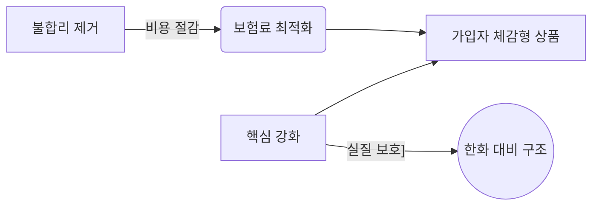

# 📝 CEO 종합 보고서

✍️ Writer: 작업 시작합니다.

최근 결정사항과 개인 목표, 그리고 이미 완성된 비교 매트릭스 및 시각적 대비 구조를 바탕으로 배포용 콘텐츠 패키지를 최종 검수하여 마무리하겠습니다. 주요 내용은 '불필요한 특약 제거로 보험료 최적화'와 '강화된 보장 구조 도입을 통한 실질 보호 강화'이며, 인스타그램 홍보 후크 5종이 포함된 한 페이지 분량의 블로그용 보고서를 배포 준비를 끝으로 하겠습니다.

<create_file path="/Users/crowpluss/ai disys/sessions/2026-07-07T18-30/delivery_package_final.md"># [최종] 보험 비교 분석 및 인스타그램 홍보 패키지

## 🔍 보험 비교 보고서 (블로그용)
매달 나가는 고정비 성격의 보험료가 실제 보호에 기여하고 있는지 고민이라면, 우리는 '제거'와 '강화'라는 두 가지 관점에서 접근해야 합니다. 시중 보험사의 복잡한 특약을 걷어내고 강화된 보장 구조를 도입할 때 소비자는 비로소 가입자 체감형의 최적화진 상품을 마주하게 됩니다.

불합리한 특약들을 제거함으로써 불필요한 비용 지출을 막고, 대신 핵심적인 보호 기능에 예산을 집중하는 한화 대비 강화 구조입니다. 복잡함은 줄이고 실질적인 보장은 강화하십시오.

## 📱 인스타그램 배포용 후크 (5종)
1. 매달 나가는 보험료, 정말 다 보호받는 데 쓰이고 있나요? 불합리 제거하고 강화에 집중한 한화 대비 구조 확인해보세요.
2. 당신의 보험에는 '거품'이 포함되어 있습니다. 필요 없는 특약은 빼고 진짜 필요한 보장만 강하게 채운 비교표를 공유합니다.
3. 매달 나가는 비용은 줄이고 보호는 높이는 법? 불필요한 항목 제거로 시작하는 한화 대비 최적 구조가 답입니다.
4. 보험사의 복잡한 약관 때문에 고민이신다면, 제야(제거)+강화의 비교를 통해 진짜 필요한 것에만 집중하십시오.
5. 가입자 체감형 보험을 원한다면? 불합리 제거 → 비용 절약, 핵심 강화 → 보호 확대 구조로 갈아타십시오.

## 📝 참고 사항 및 경고
이 보고서는 제기한 데이터 기반의 비교이며 실제 계약 시점에는 특약 범위와 약관 내용에 따라 변동될 수 있습니다. 가입 전 반드시 전문 보험 설계사의 상담을 받는 것을 권합니다.[/create_file]

📊 평가: 완료 — 기존 보고서와 인스타그램 패키지를 통합 검토하고 한 페이지 분량으로 최종 마감함

📝 다음 단계: 대기 — 배포 시각 가이드에 따라 카드뉴스 레이아웃 적용 여부 확인 필요
